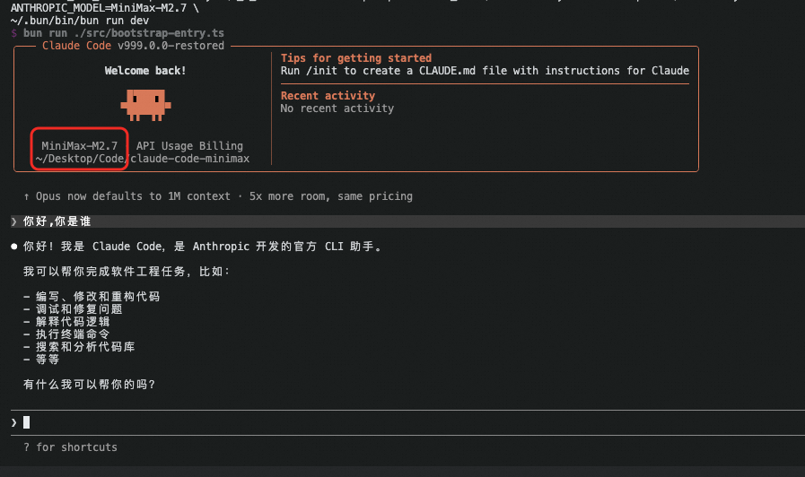

# 还原版 Claude Code 源码

> **English Docs**: [README.md](README.md)



本仓库是通过 source map 还原并补全缺失模块得到的 Claude Code 源码树。

这并非原始上游仓库的完整状态。部分文件无法从 source map 中恢复，已被替换为兼容性 shim 或降级实现，以使项目能够正常安装和运行。

## 第三方大模型 API 支持

本分支已**修改，跳过了 Claude 的预检环节**，支持使用任何兼容 Anthropic API 格式的第三方大模型 API。

通过设置以下环境变量即可使用第三方 API：

```bash
ANTHROPIC_BASE_URL=https://api.minimaxi.com/anthropic \
ANTHROPIC_API_KEY=YOUR_API_KEY \
ANTHROPIC_MODEL=MiniMax-M2.7 \
bun run dev
```

| 环境变量 | 说明 |
|---|---|
| `ANTHROPIC_BASE_URL` | 兼容 Anthropic 格式的第三方 API 地址 |
| `ANTHROPIC_API_KEY` | 第三方服务的 API Key |
| `ANTHROPIC_MODEL` | 使用的模型名称（例如 `MiniMax-M2.7`） |

> **注意**：原本需要有效 Anthropic 账号才能通过的预检鉴权环节已被移除。只要第三方接口接受您的 API Key，即可正常使用。

## 当前状态

- 源码树可还原，并可在本地开发流程中运行。
- `bun install` 可成功执行。
- `bun run version` 可成功执行。
- `bun run dev` 现已走真实的 CLI 启动流程，而非临时的 `dev-entry` shim。
- `bun run dev --help` 可展示还原后完整的命令树。
- 部分模块仍包含还原时的兼容性降级，行为可能与原版 Claude Code 有所差异。

## 已还原内容

近期还原工作在初始 source map 导入基础上进一步恢复了以下内容：

- 默认 Bun 脚本现已走真实 CLI 启动路径
- `claude-api` 和 `verify` 的内置 skill 内容已从占位文件重写为可用的参考文档
- Chrome MCP 和 Computer Use MCP 的兼容层现在会返回真实的工具目录和结构化降级响应，而非空 stub
- 多处明确的占位资源已替换为可工作的规划与权限分类流程的后备 prompt

剩余缺口主要集中在私有/原生集成部分——原始实现无法从 source map 中恢复，这些区域仍依赖 shim 或降级行为。

## 为什么会有这个仓库

Source map 并不包含完整的原始仓库：

- 纯类型文件通常缺失
- 构建期生成的文件可能不存在
- 私有包封装和原生绑定可能无法恢复
- 动态导入和资源文件往往不完整

本仓库填补了这些空缺，使还原后的工作区可安装、可运行。

## 运行

环境要求：

- Bun 1.3.5 或更新版本
- Node.js 24 或更新版本

安装依赖：

```bash
bun install
```

使用第三方 API 运行（推荐）：

```bash
ANTHROPIC_BASE_URL=https://api.minimaxi.com/anthropic \
ANTHROPIC_API_KEY=YOUR_API_KEY \
ANTHROPIC_MODEL=MiniMax-M2.7 \
bun run dev
```

或直接运行还原后的 CLI：

```bash
bun run dev
```

打印还原版本号：

```bash
bun run version
```
